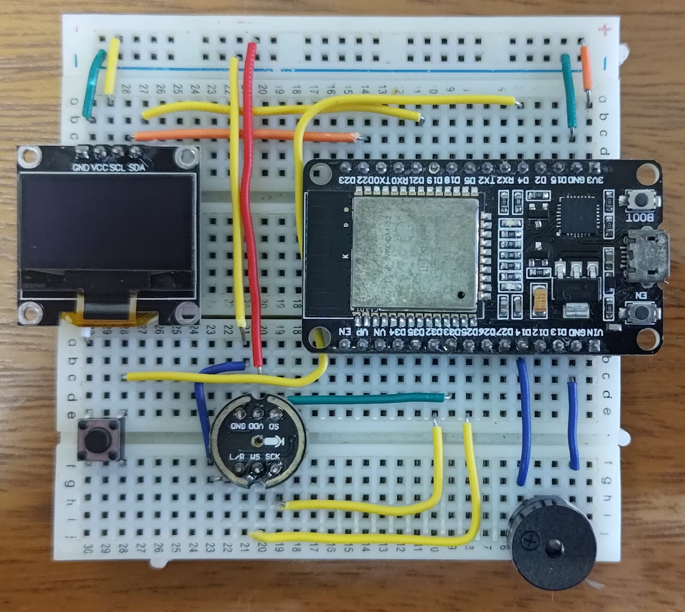
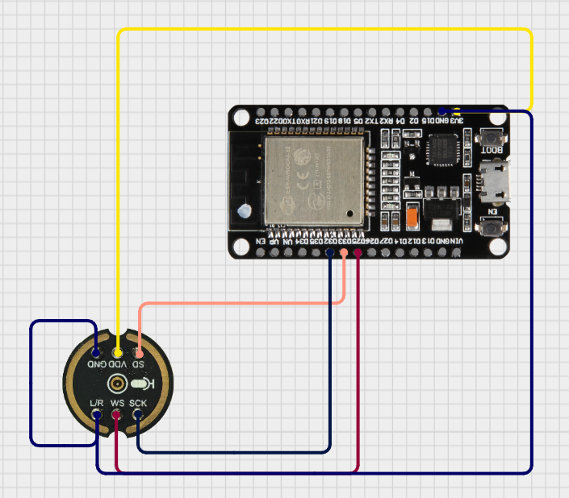

# INMP441 Microphone Library for MicroPython

MicroPython library for capturing audio from an INMP441 I2S microphone,
converting raw I2S samples to PCM16, and writing WAV headers.

This package is tuned for constrained hardware such as NodeMCU ESP32-WROOM,
where audio capture timing is sensitive.

## Features

- I2S mono capture for INMP441.
- PCM16 little-endian conversion.
- Simple background-level detection via RMS.
- WAV header generation helpers.

## Package Layout

- src/inmp441/inmp441.py: INMP441 capture class.
- src/inmp441/wav_utils.py: WAV header utilities.
- src/inmp441/__init__.py: Public package exports.
- src/example/main.py: Minimal recording example.

## Installation (MicroPython Package Manager)

Option 1: Install from GitHub with mpremote + mip

1. Connect your board via USB.
2. Run:

   mpremote mip install "github:eduardopereira-inpe/micropython-INMP441Microphone"

Option 2: Install from a local folder

1. Open a terminal in the INMP441Microphone folder.
2. Run:

   mpremote mip install .

## Quick Usage

### Hardware

- ESP32 board running MicroPython
- INMP441 I2S microphone
- SSD1306 OLED display (I2C)
- Push button
- Optional passive buzzer

#### Circuit Example
[](./images/circuit_example.jpeg)

#### Diagram Connection

[](./images/circuit_diagram_example.png)

### Code

```python
from inmp441 import INMP441, write_wav_header
import time

SAMPLE_RATE = 16000
RECORD_SECONDS = 5

mic = INMP441(
	sample_rate=SAMPLE_RATE,
	sck_pin=32,
	ws_pin=25,
	sd_pin=33,
)

total_pcm_bytes = 0
with open("test.wav", "wb") as f:
	f.seek(44)
	start = time.time()

	while time.time() - start < RECORD_SECONDS:
		chunk = mic.read_pcm16(record_mode=False)
		if chunk:
			total_pcm_bytes += f.write(chunk)

	f.seek(0)
	write_wav_header(f, SAMPLE_RATE, total_pcm_bytes)

mic.close()
```
## Hardware Notes

- Keep read_pcm16 changes conservative; this is a timing-sensitive hot path.
- On older ESP32 boards, additional allocations or extra calls inside the
  sample loop can degrade audio quality.
- Validate changes on the real board after each modification.

## License

This project is licensed under Apache-2.0.

Why Apache-2.0 for this project:

- Like MIT/BSD, it stays permissive and business-friendly.
- It adds explicit patent grant and patent retaliation terms,
  which is useful for hardware-adjacent/open collaboration projects.
- It keeps contribution and redistribution rules clear for long-term use.

See LICENSE for the full text.
